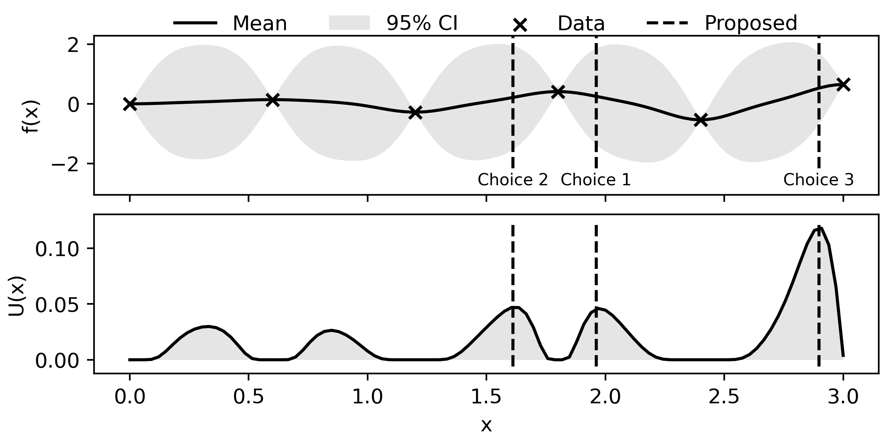

<div align="center">

# 🤝 Collabo 🤝

[](https://github.com/psf/black)
[](https://badge.fury.io/py/collabo)
[](https://opensource.org/licenses/MIT)

**A Python package for human-algorithm collaborative Bayesian optimization**

<p align="center">
  
</p>


</div>

## 📖 About

Collabo is a tool designed to facilitate collaboration between humans and Bayesian optimization. It will propose multiple solutions, from which a human selects, as opposed to a single one at each iteration by solving a high-throughput Bayesian optimization problem using multi-objective optimization. 

In doing so, the human expert has the ability to spot good, or bad candidates before they are evaluated. 

Collabo also enables the human to select specific solutions during the initial design of experiments. 

## 🚀 Installation

Install Collabo easily using pip:

```bash
pip install collabo
```

## 🛠️ Usage

Collabo offers flexibility in its usage, accommodating both manual input scenarios and function-based evaluations.


### Basic Usage

```python
import collabo as cb 

# Initialize a collaborator object
colleague = cb.Collaborator('./data.json', bounds=[(0,5), (0,5), (0,5), (0,5)])

# Design experiments
colleague.design_experiments(10)

# Propose solutions
colleague.propose_solutions(3)

# Return proposed solutions
choices = colleague.return_choices()

# Plot current proposals (only for 1D functions)
colleague.plot_current_choices()

# Choose a solution to evaluate
colleague.make_choice(2)

# Save current data
colleague.save_data()

```

### Expert-Informed Design

Collabo allows for expert-informed design of experiments by optimally distributing initial solutions around fixed pre-defined solutions:

```python
colleague.design_experiments(10, fixed_solutions=[[1,1,1,1], [2,2,2,2], [3,3,3,3]])
```

### Loading Existing Data

You can load data from a previously generated JSON file or use existing experiments, provided they are in the correct format:

```python
colleague.load_data('./data.json')
```

The JSON file should have the following structure:

```json
{
  "experiments": [
    {"solution": [0.0, 0.0, 3.3, 3.3], "objective": 6.6},
    {"solution": [1.6, 3.3, 1.6, 1.6], "objective": 8.3},
    {"solution": [3.3, 1.6, 5.0, 0.0], "objective": 10.0},
    {"solution": [5.0, 5.0, 0.0, 5.0], "objective": 15.0},
    {"solution": [5.0, 0.0, 4.98, 4.99], "objective": 14.98}
  ]
}
```


### More information & Citation 

Paper: [Human-algorithm collaborative Bayesian optimization for engineering systems](https://doi.org/10.1016/j.compchemeng.2024.108810)

```bibtex
@article{collabo,
title = {{Human-algorithm collaborative Bayesian optimization for engineering systems}},
journal = {Comput. Chem. Eng.},
pages = {108810},
year = {2024},
issn = {0098-1354},
doi = {https://doi.org/10.1016/j.compchemeng.2024.108810},
url = {https://www.sciencedirect.com/science/article/pii/S009813542400228X},
author = {Tom Savage and Ehecatl Antonio {del Rio Chanona}},
keywords = {Bayesian optimization, Experimental design, Human-in-the-loop, Domain knowledge}
}
```


## 🗓️ Roadmap

We're constantly working to improve Collabo. Here are some features we're planning to implement:

- [ ] Improve data loading and current state management
- [ ] Implement storage and visualization of proposed and selected choices
- [ ] Enhance documentation with more examples and use cases
- [ ] Develop a graphical user interface for easier interaction
  
## 🤝 Contributing

If you'd like to contribute, please:

1. Fork the repository
2. Create your feature branch (`git checkout -b feature/AmazingFeature`)
3. Commit your changes (`git commit -m 'Add some AmazingFeature'`)
4. Push to the branch (`git push origin feature/AmazingFeature`)
5. Open a Pull Request

## 📄 License

This project is licensed under the MIT License. See the [LICENSE](LICENSE) file for details.

---

<p align="center">By Tom Savage, Antonio del Rio Chanona, and not without the OptiML PSE Group.</p>
